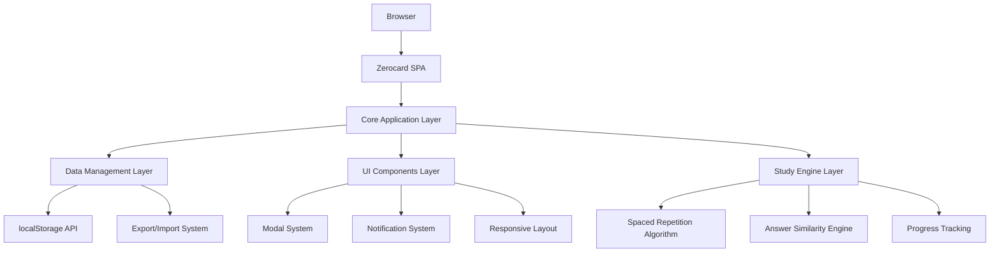

# Zerocard Web Application - Design Document

## Overview

Zerocard is a modern, client-side web application built with vanilla JavaScript ES6 modules, HTML5, and CSS3. The application follows a single-page application (SPA) architecture with local data persistence using browser localStorage. The design emphasizes performance, accessibility, and a smooth user experience across all devices.

## Architecture

### High-Level Architecture



### Application Layers

1. **Presentation Layer**: HTML templates, CSS styling, DOM manipulation
2. **Application Logic Layer**: Core Zerocard class, event handling, state management
3. **Data Layer**: localStorage interface, data models, persistence
4. **Study Engine**: Learning algorithms, progress tracking, session management

### Technology Stack

- **Frontend**: Vanilla JavaScript (ES6+), HTML5, CSS3
- **Module System**: ES6 Modules
- **Storage**: Browser localStorage with JSON serialization
- **Build Process**: None required - direct browser execution
- **Deployment**: Static file hosting (any web server)

## Components and Interfaces

### Core Application Class

```javascript
class Zerocard {
    constructor()
    initializeElements()
    attachEventListeners()
    loadLocalDecks()
    saveDecks()
    updateDisplay()
}
```

**Responsibilities:**
- Application initialization and lifecycle management
- DOM element binding and event handling
- Data persistence coordination
- UI state management

### Data Models

#### Card Model
```javascript
{
    id: string,           // Unique identifier
    front: string,        // Question/prompt
    back: string,         // Answer/explanation
    deck: string,         // Deck identifier
    difficulty: string,   // 'easy', 'medium', 'hard'
    status: string,       // 'new', 'learning', 'review'
    confidence: number,   // 0-100 confidence score
    nextReview: Date,     // Next scheduled review
    created: Date,        // Creation timestamp
    lastReviewed: Date,   // Last review timestamp
    reviewCount: number,  // Total review count
    streakCount: number   // Consecutive correct answers
}
```

#### Deck Model
```javascript
{
    id: string,          // Unique identifier
    name: string,        // Display name
    cards: Card[],       // Array of cards
    created: Date,       // Creation timestamp
    lastStudied: Date    // Last study session
}
```

#### Session Statistics
```javascript
{
    correct: number,     // Correct answers in session
    total: number,       // Total cards reviewed
    streak: number,      // Current streak
    maxStreak: number,   // Best streak in session
    xp: number,          // Experience points
    focusScore: number   // Focus percentage
}
```

### UI Components

#### Modal System
- **Purpose**: Reusable modal dialogs for forms and confirmations
- **Features**: Backdrop blur, animation, keyboard navigation
- **Types**: Authentication, card editing, deletion confirmation

#### Notification System
- **Purpose**: User feedback for actions and errors
- **Features**: Auto-dismiss, different types (success, error, warning)
- **Position**: Top-right corner with slide-in animation

#### Responsive Layout System
- **Breakpoints**: 768px (tablet), 480px (mobile)
- **Grid System**: CSS Grid and Flexbox
- **Components**: Header, sections, cards, forms

### Study Engine Components

#### Spaced Repetition Algorithm
```javascript
calculateNextReview(card, response) {
    // SM-2 inspired algorithm
    // Factors: difficulty, previous performance, time intervals
    // Returns: next review date
}
```

#### Answer Similarity Engine
```javascript
calculateSimilarity(userAnswer, correctAnswer) {
    // Levenshtein distance with normalization
    // Case-insensitive comparison
    // Returns: similarity score (0-1)
}
```

#### Progress Tracking
```javascript
updateCardProgress(card, response) {
    // Update confidence, streak, review count
    // Adjust difficulty based on performance
    // Schedule next review
}
```

## Data Models

### Storage Architecture

**Primary Storage**: Browser localStorage
- **Key Pattern**: `zerocard-decks`
- **Format**: JSON serialized deck objects
- **Backup**: Export functionality for data portability

**Data Flow**:
1. Application loads → Read from localStorage
2. User actions → Update in-memory state
3. State changes → Immediately persist to localStorage
4. Export request → Generate downloadable JSON

### Data Validation

```javascript
validateCard(card) {
    // Required fields: front, back
    // Length limits: front (500 chars), back (2000 chars)
    // Valid difficulty levels
    // Proper date formats
}

validateDeck(deck) {
    // Required fields: name
    // Unique deck names
    // Valid card array
}
```

## Error Handling

### Storage Errors
- **localStorage unavailable**: Fallback to session storage with warning
- **Quota exceeded**: Cleanup old data, notify user
- **Corruption**: Reset to default state with user confirmation

### User Input Errors
- **Form validation**: Real-time validation with visual feedback
- **Empty submissions**: Prevent with disabled buttons and messages
- **Invalid data**: Sanitize input and show correction suggestions

### Application Errors
- **JavaScript errors**: Global error handler with user-friendly messages
- **Module loading**: Fallback error page with troubleshooting steps
- **Browser compatibility**: Feature detection with graceful degradation

## Testing Strategy

### Unit Testing Approach
```javascript
// Core functionality tests
testCardCreation()
testDeckManagement()
testStudySession()
testDataPersistence()
testSimilarityAlgorithm()
```

### Integration Testing
- **User workflows**: Complete study session from start to finish
- **Data persistence**: Create, modify, reload application
- **Cross-browser**: Chrome, Firefox, Safari, Edge
- **Responsive design**: Mobile, tablet, desktop viewports

### Manual Testing Scenarios
1. **New user experience**: First visit, sample cards, deck creation
2. **Power user workflow**: Multiple decks, bulk operations, export/import
3. **Study session**: Various answer types, feedback responses, progress tracking
4. **Error conditions**: Network issues, storage limits, invalid data

### Performance Testing
- **Load time**: Application initialization under 2 seconds
- **Memory usage**: Stable memory consumption during extended use
- **Storage efficiency**: Optimal JSON serialization
- **Animation performance**: 60fps animations on target devices

## Security Considerations

### Data Privacy
- **Local storage only**: No data transmitted to external servers
- **No tracking**: No analytics or user behavior tracking
- **Export control**: User controls all data export/sharing

### Input Sanitization
```javascript
sanitizeInput(input) {
    // HTML entity encoding
    // Script tag removal
    // Length limits enforcement
    // XSS prevention
}
```

### Content Security Policy
```html
<meta http-equiv="Content-Security-Policy" 
      content="default-src 'self'; script-src 'self'; style-src 'self' 'unsafe-inline';">
```

## Performance Optimization

### Loading Performance
- **Minimal dependencies**: No external libraries
- **Code splitting**: Lazy load non-critical features
- **Asset optimization**: Compressed CSS, optimized images
- **Caching strategy**: Service worker for offline functionality

### Runtime Performance
- **Virtual scrolling**: For large card lists
- **Debounced search**: Prevent excessive filtering
- **Efficient DOM updates**: Minimal reflows and repaints
- **Memory management**: Proper event listener cleanup

### Storage Optimization
```javascript
// Efficient serialization
compressData(data) {
    // Remove redundant fields
    // Optimize date storage
    // Compress repeated strings
}
```

## Accessibility Features

### Keyboard Navigation
- **Tab order**: Logical navigation flow
- **Keyboard shortcuts**: Common actions (Enter, Escape, Space)
- **Focus management**: Visible focus indicators
- **Modal trapping**: Focus stays within modals

### Screen Reader Support
```html
<!-- ARIA labels and roles -->
<button aria-label="Create new flashcard" role="button">
<div role="alert" aria-live="polite">Notification content</div>
<section aria-labelledby="study-heading">
```

### Visual Accessibility
- **Color contrast**: WCAG AA compliance (4.5:1 ratio)
- **Font sizes**: Scalable text, minimum 16px
- **Motion preferences**: Respect `prefers-reduced-motion`
- **High contrast mode**: Support for system preferences

## Progressive Web App Features

### Service Worker Strategy
```javascript
// Cache-first for static assets
// Network-first for dynamic content
// Offline fallback pages
// Background sync for future cloud features
```

### Web App Manifest
```json
{
  "name": "Zerocard - Smart Learning System",
  "short_name": "Zerocard",
  "description": "Modern flashcard application for efficient learning",
  "start_url": "/",
  "display": "standalone",
  "theme_color": "#667eea",
  "background_color": "#0f0f23",
  "icons": [
    {
      "src": "icons/icon-192.png",
      "sizes": "192x192",
      "type": "image/png"
    }
  ]
}
```

### Offline Functionality
- **Core features**: All flashcard operations work offline
- **Data sync**: Queue changes for future cloud sync
- **Update notifications**: Inform users of new versions
- **Installation prompts**: Encourage PWA installation

## Deployment Architecture

### Static Hosting Requirements
- **Web server**: Any HTTP server (Apache, Nginx, Netlify, Vercel)
- **HTTPS**: Required for PWA features and modern browser APIs
- **Compression**: Gzip/Brotli for faster loading
- **Caching headers**: Appropriate cache control for assets

### Build Process
```bash
# No build process required - direct deployment
# Optional: Minification and compression for production
# Optional: Icon generation for PWA
```

### Environment Configuration
- **Development**: Local file server with live reload
- **Production**: CDN deployment with proper headers
- **Testing**: Automated deployment for testing branches